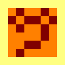

# Building a better Identicon
Implementation of a [take-home interview problem from Akkio](https://akkio.notion.site/Akkio-Take-home-Problem-3d8044df4eea4a5a85edaba31088924a)

The overall idea/design goal was pretty straightforward:
Overall design goals:
* identicons should be unique --> 8,010 unique possibilities
* identicons be human-distinguishable --> identicons based on face pixel art
* identicons should be usable at different scales --> several bit-perfect copies provided at standard square ratios

The generation process was rather straightforward:
1. pre-create pixel art for distinct facial features (10 eyes and 9 mouths).  (MS Paint worked well enough)
2. load 3-color color palettes from visually pleasing source (89 palettes from [seaborn](https://www.practicalpythonfordatascience.com/ap_seaborn_palette#all-palettes))
3. select facial features/palette based on hash of provided name/id
4. combine bitmaps of facial features
5. write 3 colors of selected palatte to (features, border, background)
6. output usable resources to `/out/{name}/{size}x{size}.bmp`

generate pixel are that is unique for arbitrary different strings
# Some example Identicons
(from strings 0..15)

| .                       | .                       | .                               | . |
|-------------------------|-------------------------|---------------------------------| ---- |
|   |   |   | 
|   |   |   | 
|   |   |  | 
|  |  |  | 

# Future work
while realistically, I'll never pick this up again, if I *were* to, I would likely...
* add more facial features (optional nose; hair)
* make border more prominent
* consider pixel-art blitting at higher resolutions 